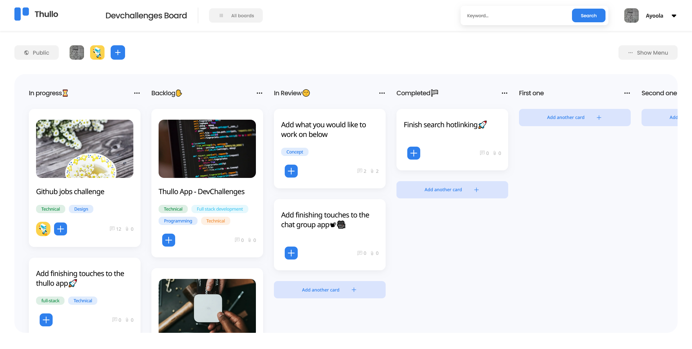

<h1 align="center">Thullo</h1>

<div align="center">
  Solution for a challenge from  <a href="https://devchallenges.io" target="_blank">Devchallenges.io</a>.
</div>

<br />

<div align="center">
  
  
  
  
  
</div>

<div align="center">
  <h3>
    <a href="https://thullo-silk.vercel.app/">
      Demo
    </a>
    <span> | </span>
    <a href="https://legacy.devchallenges.io/solutions/y2fzEzGadBna4oVa8vlU">
      Solution
    </a>
    <span> | </span>
    <a href="https://legacy.devchallenges.io/challenges/wP0LbGgEeKhpFHUpPpDh">
      Challenge
    </a>
  </h3>
</div>

<!-- TABLE OF CONTENTS -->

## Table of Contents

- [Overview](#overview)
  - [Built With](#built-with)
- [Features](#features)
- [How to use](#how-to-use)
- [Folder Structure](#folder-structure)
- [Contact](#contact)

<!-- OVERVIEW -->

## Overview🔥🧐🧐




## Built With🛠
- [NextJS](https://nextjs.org/)
- [Typescript](https://www.typescriptlang.org/)
- [PostgreSQL](https://www.postgresql.org/)
- [Prisma](https://www.prisma.io/)
- [Dnd Kit](https://docs.dndkit.com/)
- [Joi](https://www.npmjs.com/package/joi)
- [Handlebars](https://handlebarsjs.com/)

## Features🤖
This application was created as a submission to a [DevChallenges](https://devchallenges.io/challenges) challenge. The [challenge](https://https://legacy.devchallenges.io/challenges/wP0LbGgEeKhpFHUpPpDh) was to build an application to complete the given user stories:
- User story: I can see a list of available boards
- User story: I can add a new board with a cover photo, title and visibility options
- User story: I can see a board with different columns, team members according to the design
- User story: I can add a new list
- User story: I can delete an existing list
- User story: I can change the order of lists in a board by drag and drop
- User story: I can add a new card to the existing list
- User story: I can set the visibility of the board
- User story: I can add a member to the board (user must exist in the system)
- User story: I can change the name of the board by selecting it
- User story: I can change/add the description of the board
- User story: Given I am an admin, I can remove members from the board
- User story: I can move a card from a column to another one by drag and drop
- User story: When a card is selected, I can rename the title by selecting it
- User story: When a card is selected, I can see which column the card belongs to
- User story: When a card is selected, I can see and change the description
- User story: When a card is selected, I can add new attachments and I can download and delete existing attachments
- User story: When a card is selected, I can add a new comment. Given I am the author, I can edit and delete the comment.
- User story: When a card is selected, I can change the card cover image by searching from Unsplash
- User story: When a card is selected, I can add labels with given colors

## How To Use🚀
- To clone and run this application, you'll need [Git](https://git-scm.com) and [Node.js](https://nodejs.org/en/download/) (which comes with [npm](http://npmjs.com)) installed on your computer. From your command line:
  ```bash
  # Clone this repository
  $ git clone https://github.com/Josh-Ay/thullo

  # Install all dependencies
  $ npm install
  ```

- Create a `.env` file in the root directory of your cloned copy and copy and paste the following environment variables into it 
  ```txt
  POSTGRES_PRISMA_URL="postgresql://postgres:<password>@<server>/thulloDB"
  GOOGLE_ID=""
  GOOGLE_SECRET=""
  GITHUB_ID=""
  GITHUB_SECRET=""
  NEXTAUTH_SECRET=""
  NEXTAUTH_URL="http://localhost:3000"
  UNSPLASH_ACCESS_KEY=""
  ADMIN_MAIL="<your-gmail-here>"
  ADMIN_MAIL_PASSWORD=""
  SERVER_URL="http://localhost:3000"
  ```

  - Replace the `<password>` and `<server>` in the `POSTGRES_PRISMA_URL` with your actual credentials to access a POSTGRES database
  - To get the values for `GOOGLE_ID`, `GOOGLE_SECRET`, please have a look at this [link](https://support.google.com/cloud/answer/6158849?hl=en)

  - To get the values for `GITHUB_ID`, `GITHUB_SECRET`, please have a look at this [link](https://docs.github.com/en/apps/oauth-apps/building-oauth-apps/authenticating-to-the-rest-api-with-an-oauth-app)

  - To get the value of `NEXTAUTH_SECRET`, simply type this in your bash terminal and copy-paste the result of the command:
    ```bash
    openssl rand -base64 32
    ```

  - To obtain a value for the `UNSPLASH_ACCESS_KEY` variable, please have a look at [this](https://unsplash.com/documentation)

  - To get the value for `ADMIN_MAIL_PASSWORD`, you can have a look at [this](https://support.google.com/accounts/answer/185833?hl=en)

- After you are all done getting all the required environment variables, the very last step is to run the following from your commmand line:
  ```bash
  # Run the app
  $ npm run dev
  # or
  $ npm start
  # or
  yarn dev
  # or
  pnpm dev
  # or
  bun dev
  ```

- Open [http://localhost:3000](http://localhost:3000) with your browser to see the result 🚀.

## Folder Structure🔍
A brief overview of the project structure to get yourself all acquainted with what each folder or file entails:

```bash
├── @types
├── app/
│   ├── api/
│   │   ├── auth/
│   │   ├── boards/
│   │   ├── cards/
│   │   ├── imageSearch/
│   │   ├── lists/
│   │   ├── search/
│   │   ├── user/
│   ├── auth/
│   ├── boards/
│   ├── profile/
│   ├── globals.css
│   ├── layout.tsx
│   ├── page.module.css
│   ├── page.tsx
├── assets/
├── components/
├── contexts/
├── hooks/
├── lib/
├── prisma/
├── public/
├── services/
├── templates/
├── types/
├── utils/
```

## Contact💌
- GitHub [@Josh-Ay](https://{github.com/Josh-Ay})
